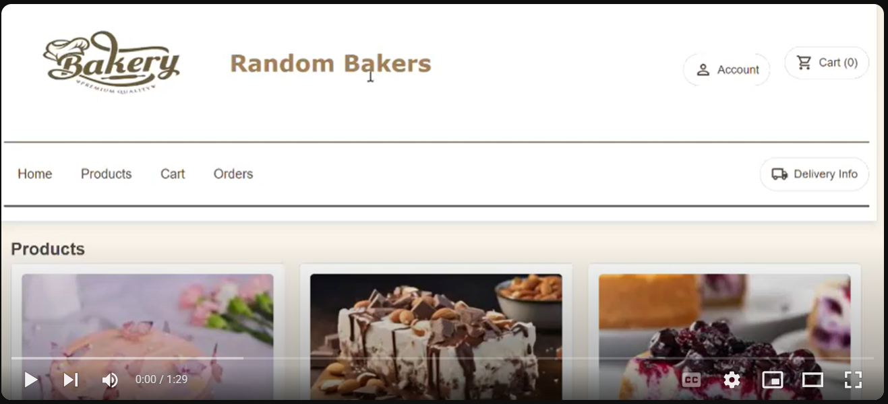

🍰 **Random Bakers**

Random Bakers is an e-commerce web application where users can browse and purchase delicious bakery items. Built with a React frontend and a Node.js backend, this platform provides a smooth and intuitive experience for users to shop for their favorite baked goods online.

🧁 **Features**

🔐 **User Authentication:** Login and signup functionality to create and manage accounts

🛒 **Add to Cart:** Select bakery items and add them to the shopping cart

📦 **Place Orders:** Provide delivery address and place your order with ease

📊 **Order Management:** Backend manages orders, products, and users efficiently

🧁 **Product Listings:** Display available bakery items with relevant details

🛠️ **Tech Stack**

**Frontend:** React.js

**Backend:** Node.js with Express.js

**Database:** MySQL

🎬 Demo Video

🔗 Click the image above to watch a full demo of Random Bakers in action!

📬 **Contact**

For any questions or suggestions, feel free to reach out at basanthnalla987@gmail.com
